# ChartGenie AI: Architecture & System Design Document

**Document Version:** 1.0.0  
**Status:** Approved for Implementation Roadmap  
**Role:** Lead Product Manager & Principal Architect  
**Project:** ChartGenie.xyz  

---

## 1. Executive Summary & Product Vision

ChartGenie's core competitive advantage is **zero-friction data storytelling**: no login screens, no paywalls, instant social media exports, and 17 versatile chart types. 

The goal for the **Natural Language & AI Research Feature** is to allow any user to type a casual prompt (e.g., *"Compare top 5 EV battery manufacturers by 2026 market share with key takeaway and source"*) and receive:
1. Valid, clean, well-formatted numerical data.
2. The optimal chart type (e.g., Horizontal Bar, Donut, Stacked Column).
3. Professional title, subtitle, and cited data source.
4. A punchy viral insight annotation (`calloutMetric`).

Crucially, this must be delivered **at $0.00/month infrastructure cost** during early growth while being fully protected against bot scraping, rate limits, and vendor lock-in.

---

## 2. Competitive Deconstruction: ChartGenie vs. `Vinay-Khanagavi/chartgeine`

The open-source repository [Vinay-Khanagavi/chartgeine](https://github.com/Vinay-Khanagavi/chartgeine) attempted a similar concept but suffered from fatal architectural flaws that prevented organic adoption:

| Dimension | `Vinay-Khanagavi/chartgeine` | ChartGenie.xyz Architecture | Strategic Benefit |
| :--- | :--- | :--- | :--- |
| **Authentication** | Mandatory Clerk Auth | **Zero Authentication (Hobby & Viral)** | Eliminates 85% drop-off at landing |
| **Database** | Pinecone Vector DB + Firebase | **Stateless Edge Functions (No DB)** | $0 maintenance, zero vector DB bills |
| **Backend** | Heavy Node.js container server | **Vercel Serverless Function (`/api`)** | Instant cold starts, scales to 0 |
| **AI Reliability** | Unconstrained LLM text output | **Vercel AI SDK + Zod Structured Schema** | 100% type-safe JSON, zero hallucinations |
| **Hosting Cost** | ~$35–$70/month baseline | **$0.00/month (Google + Vercel Free Tiers)** | Sustainable indefinitely with 0 revenue |
| **Fallback** | Hard error on API quota limit | **Dual-Engine Smart Client Fallback** | 100% uptime even if API is offline |

---

## 3. High-Level System Architecture

```mermaid
flowchart TD
    User([User Prompt: "Compare Top EV Makers 2026"]) --> Client[ChartGenie Web Client / SPA]
    
    subgraph ClientLayer [Client-Side Layer - ChartGenie.xyz]
        Client --> CreditCheck{Daily AI Credits > 0?}
        CreditCheck -- "Exhausted (5/5)" --> ModalOptions[Show Quota Modal: Wait / BYOK / Pro]
        CreditCheck -- "Credits Available" --> Dispatcher[AI Dispatcher]
        
        BYOKInput[User Enters Free Gemini Key] -.-> Dispatcher
    end

    subgraph VercelEdge [Vercel Edge & Serverless Layer]
        Dispatcher -->|POST /api/generate-chart| VercelFn[Vercel Serverless Function]
        VercelFn --> RateLimiter{IP Rate Limiter < 10/min}
        RateLimiter -- Exceeded --> FallbackResp[429 Quota Exceeded]
        RateLimiter -- OK --> VercelAI[Vercel AI SDK: generateObject]
    end

    subgraph LLMProviders [AI Model Provider Layer]
        VercelAI --> GoogleGemini[Google Gemini 2.0 Flash / Free Tier]
        GoogleGemini --> ZodValidator[Zod Output Validation]
    end

    ZodValidator -->|Clean JSON| Client
    FallbackResp -->|Failover Trigger| LocalNLP[Client Deterministic NLP Extractor]
    LocalNLP -->|Instant Heuristic Chart| Client

    Client --> Canvas[<ChartCanvas> Stage Display]
    Canvas --> SocialExport[1-Click Reddit Table / 4K PNG / X Post]
```

---

## 4. Dual-Engine Execution Pipeline

To guarantee 100% availability without service interruptions, ChartGenie operates on a **3-tier graceful failover pipeline**:

### Tier 1: Cloud AI Research (Default)
* **Endpoint**: `/api/generate-chart`
* **Engine**: Google Gemini 2.0 Flash via Vercel AI SDK.
* **Payload**: User prompt string.
* **Returns**: Fully researched categories, real estimated metrics, cited source, and chart preset selection.

### Tier 2: Bring-Your-Own-Key (BYOK)
* For power users or when cloud quota is reached.
* User inputs their own free Gemini API key (stored only in `localStorage`).
* Directly executes client-side calls to Google AI Studio with zero proxy overhead and zero cost to ChartGenie.

### Tier 3: Local Deterministic NLP Extractor (Offline / Emergency Fallback)
* If the API is unreachable, rate-limited, or the user is offline:
* `aiParser.ts` executes locally in milliseconds.
* Parses tabular data, regex patterns (`"Label: 45"`), and keyword heuristics without displaying an error dialog.

---

## 5. Zod Schema Specification (`api/generate-chart.ts`)

The AI output is strictly locked by Vercel AI SDK’s `generateObject` to prevent broken JSON or markdown formatting issues:

```typescript
import { z } from 'zod';

export const ChartGenerationSchema = z.object({
  title: z.string().describe('Concise, professional headline for the chart (max 60 chars)'),
  subtitle: z.string().describe('Time period, geographic scope, or methodology context'),
  recommendedType: z.enum([
    'bar',
    'horizontalBar',
    'stackedColumn',
    'stackedHorizontal',
    'stackedBar',
    'line',
    'stackedLine',
    'area',
    'stackedArea',
    'pie',
    'donut',
    'radar',
    'scatter',
    'heatmap',
    'threshold',
    'gauge',
    'funnel'
  ]).describe('The single best visual format for this specific data structure'),
  calloutMetric: z.string().describe('Key insight or surprising takeaway badge, e.g. "💡 48% Global Share"'),
  dataSource: z.string().describe('Authentic source citation, e.g. "Statista / Bloomberg NEF 2026"'),
  data: z.array(
    z.object({
      id: z.string(),
      name: z.string().describe('Category or data point label'),
      value: z.number().describe('Clean numeric value without symbols or units')
    })
  ).min(2).max(12).describe('Between 2 and 12 distinct data rows for clean visual rendering')
});
```

---

## 6. Financial Economics: Why It Costs $0/Month

### Google AI Studio (Gemini 2.0 Flash)
* **Free Tier Quota**:
  * **15 RPM** (Requests Per Minute)
  * **1,500 RPD** (Requests Per Day = 45,000 requests/month)
  * **1,000,000 TPM** (Tokens Per Minute)
* **Monthly Cost**: **$0.00**

### Vercel Hobby Plan
* **Serverless Invocations**: 100,000 function executions/month included free.
* **Edge Network**: 100 GB fast bandwidth included free.
* **Monthly Cost**: **$0.00**

### Pay-As-You-Go Scale Buffer (If Limits Are Exceeded)
If the project outgrows the free tier:
* Gemini 2.0 Flash pricing: **$0.10 / 1M input tokens**, **$0.40 / 1M output tokens**.
* Average chart query: ~150 input tokens, ~300 output tokens = **$0.000135 per chart**.
* **10,000 charts = $1.35**.

---

## 7. Rate Limiting, Scarcity & User Quotas

### Why Rate Limiting is Mandatory
1. **Prevent Quota Depletion**: Protects the 1,500 requests/day pool from being consumed by a single script.
2. **Prevent 429 Errors**: Smoothes traffic spikes to stay under Google's 15 RPM limit.
3. **Freemium Scarcity Engine**: Establishes perceived value for AI features, creating demand for the Pro tier.

### Quota Structure
* **Free Tier Users**: **5 AI Charts per day** (zero signup required, tracked via `localStorage` timestamp + IP header).
* **Reset Schedule**: Rolling 24-hour reset at midnight local time.
* **Core Tooling Exemption**: Manual chart editing, CSV imports, Reddit table generation, and downloads remain **100% unlimited**.

---

## 8. Freemium to Pro Monetization Roadmap

```mermaid
graph LR
    subgraph FreeTier [Free Tier - $0/mo]
        F1[Unlimited Manual Charts]
        F2[All 17 Chart Types]
        F3[Reddit Table Export]
        F4[5 AI Research Charts / Day]
    end

    subgraph ProTier [ChartGenie Pro - $7/mo or $39 Lifetime]
        P1[Unlimited AI Research]
        P2[Live Web Search Grounding]
        P3[Remove Watermark]
        P4[Vector SVG & 8K Retina Exports]
        P5[Multi-Series Historical Tracking]
    end

    FreeTier -->|Hits 5/day Limit| UpgradeModal{Upgrade Hook}
    UpgradeModal -->|Convert 3-5%| ProTier
```



---

## 9. Phased Implementation Roadmap

### Phase 1: Foundation (Vercel Serverless Function + Fallback)
- [x] Document system architecture & economics.
- [ ] Configure `vercel.json` SPA rewrite exclusions for `/api/*`.
- [ ] Implement `api/generate-chart.ts` with Vercel AI SDK & Gemini 2.0 Flash.
- [ ] Add client-side 5-credit daily tracker in `src/lib/aiParser.ts`.

### Phase 2: User Experience (Credits UI & BYOK)
- [ ] Update `AiPromptModal.tsx` with a badge showing remaining daily credits (`3 of 5 remaining today`).
- [ ] Add optional **"Use Custom Gemini Key"** setting in local storage for unlimited personal usage.
- [ ] Implement smooth loading skeletons and research steps (`"Analyzing sources..."`, `"Structuring data..."`).

### Phase 3: Monetization & Search Grounding (Post-Traffic)
- [ ] Enable Google Search Grounding for real-time 2026 live web facts.
- [ ] Integrate Stripe payment checkout for ChartGenie Pro.
