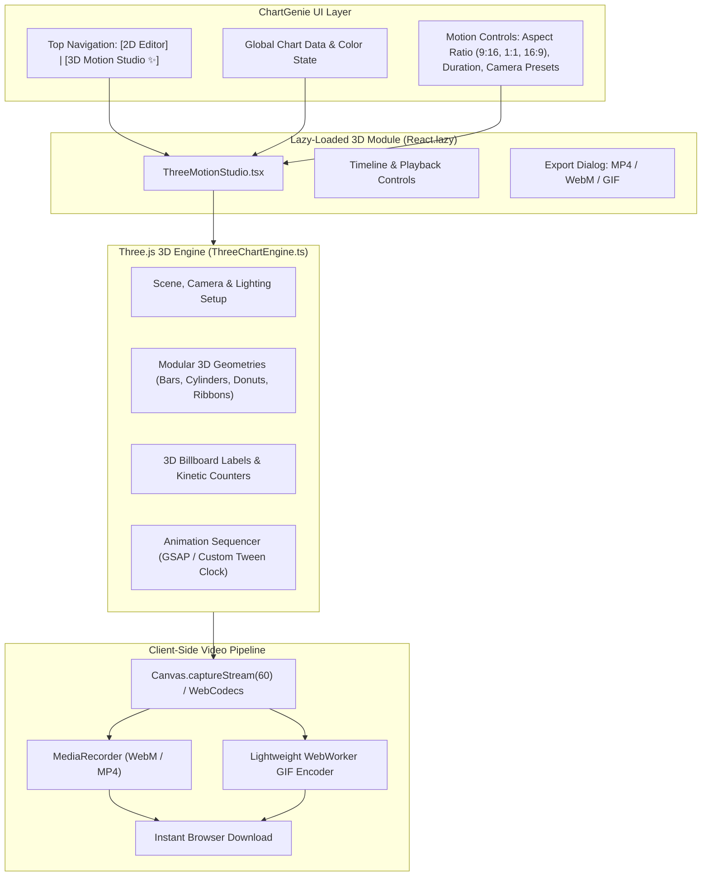
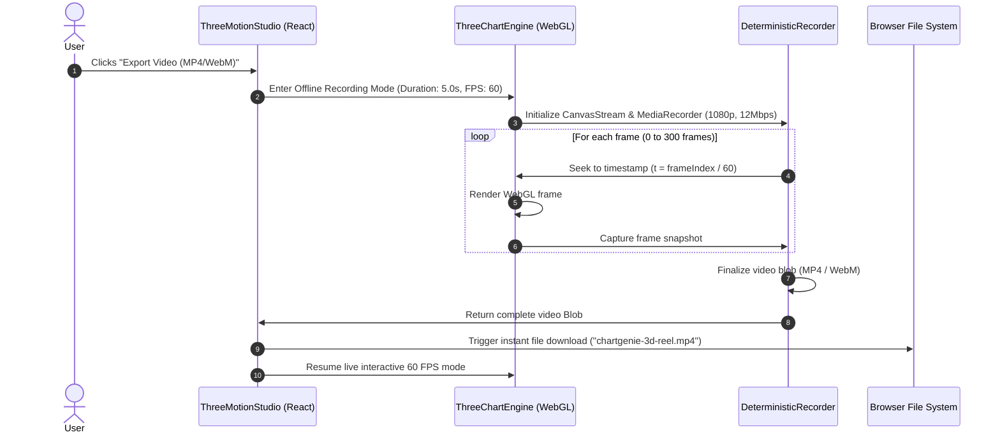

# Three.js 3D Motion Studio: Technical Architecture & Design Specification

> **Status**: Validated Design  
> **Target Release**: Future Major Feature  
> **Cost Profile**: **$0/month** (100% Client-Side WebGL & WebCodecs on Vercel Hobby)  
> **Primary Use-Case**: High-engagement animated motion charts for Instagram Reels, TikTok, YouTube Shorts, LinkedIn, and X.

---

## 1. Executive Summary & Goals

The **3D Motion Studio** extends ChartGenie from a static 2D vector chart generator into an automated **social motion graphics engine**. By leveraging Three.js and client-side browser video recording (`canvas.captureStream` + `MediaRecorder` / WebCodecs), users can instantly convert their data into cinematic 3D animated video clips (MP4/WebM) and GIFs ready for social media feeds without needing video editing software (After Effects, Premiere, or Blender).

### Core Objectives:
1. **Viral Social Formats**: Native support for **9:16 (Vertical Reels/TikTok)**, **1:1 (Square Feed)**, and **16:9 (Landscape YouTube/LinkedIn)**.
2. **Signature Cinematic Choreography**: Staggered 3D element growth, dynamic 360° camera orbit, kinetic floating value counters, and contact shadow depth.
3. **$0 Infrastructure Overhead**: Zero backend GPU rendering clusters or serverless cloud instances; 100% encoded client-side in the user's browser.
4. **Zero Impact on 2D App Core**: Three.js and video encoders are strictly code-split via dynamic `import()` and `React.lazy()`, maintaining ChartGenie's sub-second initial load time.

---

## 2. Decision Log (DEC)

| Decision ID | Decision | Alternatives Considered | Rationale |
| :--- | :--- | :--- | :--- |
| **DEC-001** | **Primary Output Format: Video (MP4/WebM) & GIF** | Static 3D images, interactive embed-only | Social media algorithms (TikTok, Reels, LinkedIn video) prioritize short, looping, high-motion video content over static images or external links. |
| **DEC-002** | **Dedicated "3D Motion Studio" Mode** | Modal pop-up inside 2D editor | Social videos require specific canvas dimensions (9:16, 1:1), animation speed controls, camera presets, and a timeline scrubber that deserve dedicated studio UI space. |
| **DEC-003** | **100% Client-Side Video Capture** | Serverless Remotion / Headless Chrome Lambda | Renders directly in browser with `MediaRecorder` & WebCodecs. Eliminates cloud server compute bills completely ($0 cost on Vercel Hobby) and guarantees 100% user data privacy. |
| **DEC-004** | **Vanilla Three.js in Modular Class (`ThreeChartEngine`)** | `@react-three/fiber` (R3F), Remotion Web | Bypasses React reconciliation overhead for true 60 FPS rendering; allows deterministic offline frame-stepping during video recording; avoids R3F version conflicts and bundle bloat. |
| **DEC-005** | **Lazy-Loaded Dynamic Chunking** | Bundling Three.js in main vendor chunk | Three.js (~140 KB gzip) is only downloaded when the user enters "3D Motion Studio". The primary 2D ChartGenie app remains ultra-lightweight. |
| **DEC-006** | **Deterministic Frame Capture for Export** | Real-time screen recording | Prevents dropped frames on low-powered laptops or phones. The engine steps the clock forward by `1/60s` per frame and captures synchronously, producing flawless 60 FPS output regardless of device speed. |

---

## 3. High-Level System Architecture



---

## 4. 3D Engine Architecture (`ThreeChartEngine.ts`)

The 3D engine is encapsulated in an imperative TypeScript class with zero React bindings in its internal render loop for maximum performance.

### 4.1 Lighting, Environment & Studio Stage
* **Lighting Model**:
  * **Key Light**: Directional light with soft cascaded shadow maps (`castShadow = true`, PCFSoftShadowMap).
  * **Fill Light**: Subtle hemisphere light providing soft ambient coloration matching the user's selected palette.
  * **Rim / Specular Light**: Positioned behind the geometry at a 45° angle to create metallic edge highlights and depth separation from the background.
* **Ground Stage**:
  * Reflective studio floor plane with soft contact shadow drop (`ShadowMaterial` with opacity 0.3 or custom planar mirror shader) giving elements realistic weight.
* **Camera Rig**:
  * `PerspectiveCamera` with variable FOV (45° default).
  * Smooth spherical coordinate orbit path (`radius`, `theta`, `phi`) driven by the animation sequencer.

### 4.2 Modular Procedural Geometries

| Chart Family | 3D Geometry Implementation | Visual Polish & Materials |
| :--- | :--- | :--- |
| **3D Columns & Bars** | `RoundedBoxGeometry` or `CylinderGeometry` with variable height and radius | `MeshPhysicalMaterial` with subtle roughness (0.25), transmission (0.1), and specular clearcoat (0.5). |
| **3D Donut & Pie** | Extruded `ShapeGeometry` along arc paths with beveled edges (`extrudeSettings: { bevelEnabled: true, bevelSegments: 5 }`) | Slices float slightly elevated above floor; radial separation of 2-4px between slices. |
| **3D Trend Lines & Areas** | Extruded 3D Catmull-Rom spline ribbons (`TubeGeometry` or custom strip mesh) with semi-transparent curtain falloff to the floor | Glowing neon core bead (`SphereGeometry`) at data vertices with emissive pulse. |
| **3D Heatmap Matrix** | Elevated 3D voxel cubes arranged on a 2D floor grid with variable elevation heights | Acrylic glass block look with interior depth coloring. |

### 4.3 3D Kinetic Typography & Billboard Labels
* In 3D space, text labels must remain legible regardless of camera orientation.
* **Solution**: Billboard sprites or high-DPI dynamic HTML5 canvas textures mounted on 3D quads that automatically update their quaternion to face the camera:
  ```typescript
  labelMesh.quaternion.copy(camera.quaternion);
  ```
* **Kinetic Counter**: Numbers smoothly count up from `0` to their final values (e.g. `$0` ➔ `$1,450,000`) synchronized with element growth.

---

## 5. Signature Motion Choreography: "Full Cinematic Suite"

The default animation choreography is optimized for 3–5 second social media attention spans:

```
0.0s                   1.2s                   3.0s                   4.5s       5.0s
|----------------------|----------------------|----------------------|----------|
[  PHASE 1: BUILD UP   ] [      PHASE 2: CAMERA ORBIT        ] [ PHASE 3: HERO HOLD ]
- Bars grow from zero   - Camera sweeps 45° to -15° orbit      - Camera settles
- Number counters roll  - Depth of field / light sheen moves   - Final labels pulse
- Soft ground shadows   - Specular reflections glide           - Ready for loop
```

1. **Phase 1: Dynamic Build-Up (0.0s – 1.2s)**:
   * Elements rise from the ground plane using an elastic/spring ease-out curve.
   * Staggered delay: Each bar begins growing 60ms after the preceding one, creating a fluid wave effect.
   * Number counters tick upwards in real time.
2. **Phase 2: Cinematic 360° Orbit (0.8s – 3.2s)**:
   * Camera glides along an orbital arc, shifting perspective from a dynamic low-angle 3D view to a balanced front-isometric presentation.
   * Directional highlights catch the beveled edges of the meshes as the camera moves.
3. **Phase 3: Hero Hold & Call-to-Action (3.2s – 5.0s)**:
   * Motion eases to a gentle breathing hover.
   * The top-performing bar or category receives a subtle pulse glow or highlight ring.
   * Perfect freeze frame / seamless loop point for video replay on social feeds.

---

## 6. Client-Side Video & GIF Export Pipeline

To maintain **$0 cloud hosting costs**, rendering and encoding happen entirely in the browser:



### Deterministic Recording Guarantee:
Unlike naive screen recorders that stutter if the computer lags, the **Deterministic Time-Stepping Loop** manually steps the animation clock frame-by-frame:
```typescript
async function renderToVideo(duration: number, fps: number = 60) {
  const totalFrames = duration * fps;
  const timeStep = 1 / fps;
  
  for (let frame = 0; frame < totalFrames; frame++) {
    engine.updateAtTime(frame * timeStep); // Exact time step
    engine.render();
    await recorder.recordFrame();
  }
}
```
This guarantees **flawless 60 FPS output with zero frame drops**, even on older laptops or mobile devices!

---

## 7. Supported Social Aspect Ratios

| Aspect Ratio | Canvas Resolution | Target Platforms | Layout Optimization |
| :--- | :--- | :--- | :--- |
| **9:16 Vertical** | 1080 × 1920 | Instagram Reels, TikTok, YouTube Shorts | Vertical camera tilt; chart positioned in middle 60% safe zone; top title header and bottom data source footer. |
| **1:1 Square** | 1080 × 1080 | Instagram Feed, LinkedIn, Twitter/X Post | Symmetrical camera distance; balanced 3D isometric view. |
| **16:9 Landscape** | 1920 × 1080 | YouTube, LinkedIn Video, Presentations | Wide horizontal layout; bars spread comfortably along the X-axis; side-by-side metric callouts. |

---

## 8. WebGL Lifecycle, Memory & Error Management

1. **Memory Safety & Cleanup**:
   * When navigating away from the 3D Motion Studio, `ThreeChartEngine.dispose()` recursively traverses the scene:
     - Disposes all `BufferGeometry` instances.
     - Disposes all `Material` instances and associated textures.
     - Calls `WebGLRenderer.dispose()` and forcefully drops the WebGL context.
2. **Context Loss Recovery**:
   * Listens for `webglcontextlost` and gracefully notifies the user with an option to restore or revert to 2D SVG mode without data loss.
3. **Hardware Acceleration Fallback**:
   * Checks `renderer.capabilities.isWebGL2`. If WebGL is disabled or unsupported in an ultra-restricted corporate environment, presents a friendly notice directing the user to the standard SVG export.

---

## 9. Phased Implementation Roadmap

* **Phase 1: 3D Core Engine & First 3D Geometries**:
  * Set up modular `ThreeChartEngine.ts` and dynamic route/tab.
  * Implement 3D Bars/Columns and 3D Donut/Pie with studio lighting and floor shadow.
  * Live camera orbit controls (`OrbitControls`) and play/pause preview.
* **Phase 2: Cinematic Choreography & Timeline**:
  * Build the "Full Cinematic Suite" animation timeline (staggered rise, 360° pan, floating counter).
  * Aspect ratio switcher (9:16, 1:1, 16:9) with camera auto-framing.
* **Phase 3: Client-Side Video & GIF Exporter**:
  * Deterministic 60 FPS video recording via `MediaRecorder` / WebCodecs.
  * MP4 and WebM export with live render progress bar.
  * WebWorker GIF generator for lightweight animated GIF loops.
* **Phase 4: Extended 3D Types & Audio/Sound Integration**:
  * Add 3D Ribbon Trends, 3D Heatmap topography, and particle confetti on climax.
  * Optional ambient sound effects (whoosh on bar rise, soft pop on count-up).
